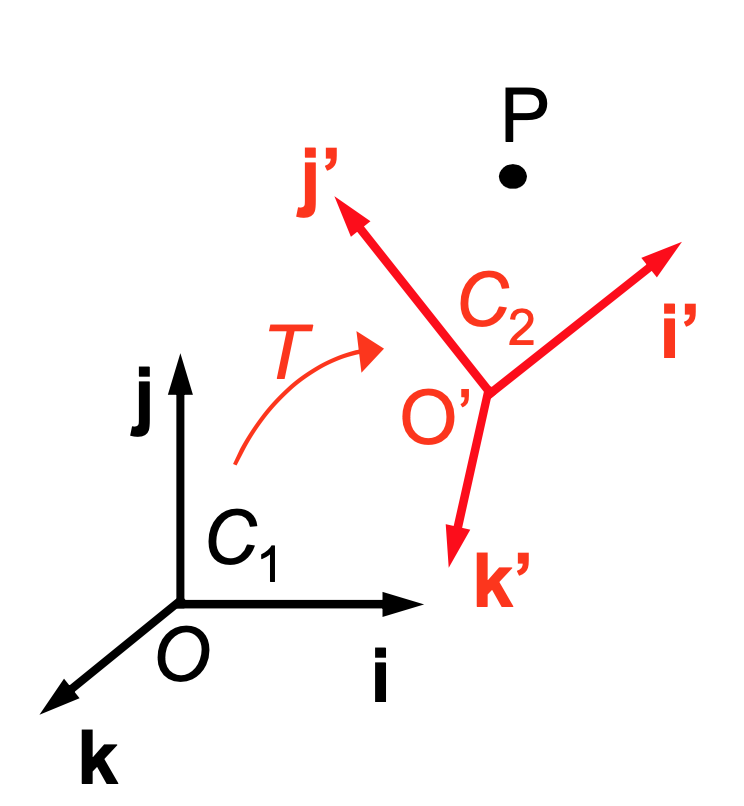
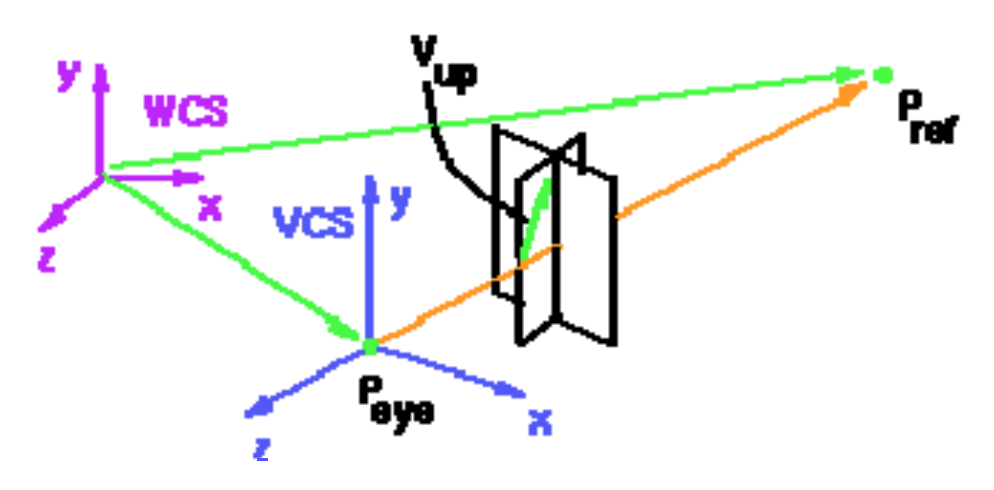

# Change of Basis and Model-view Transformation

- CS174A, discussion 1A, Winter 2020.
- Instructor: [Demetri Terzopoulos](http://web.cs.ucla.edu/~dt/)
- TA: Yunqi Guo
- https://github.com/luckiday/cs174a-1a-2020w

## Outline

- Change of basis
- Model-view Transformation

## Change of basis

<u>**Recall**</u>: (Coordinate Systems) In homogeneous coordinate systems, a vector is denoted as:
$$
\boldsymbol{v} = 
v_1 \boldsymbol{a}+v_2 \boldsymbol{b}+v_3 \boldsymbol{c}
\rightarrow 
\boldsymbol{v} = 
\begin{bmatrix}
\boldsymbol{a}& \boldsymbol{b} &\boldsymbol{c} & O
\end{bmatrix}
\begin{bmatrix}
v_1\\v_2\\v_3\\0
\end{bmatrix}
$$
A point is 
$$
P = 
p_1 \boldsymbol{a}+p_2 \boldsymbol{b}+p_3 \boldsymbol{c} + O
\rightarrow 
P = 
\begin{bmatrix}
\boldsymbol{a}& \boldsymbol{b} &\boldsymbol{c} & O
\end{bmatrix}
\begin{bmatrix}
p_1\\p_2\\p_3\\1
\end{bmatrix}
$$

#### Transformations as a change of basis

<u>**Question**</u>: if we apply a transformation, $M_1$, to coordinate system $C_1$, and get $C_2$, what is the new position of $P$ in $C_2$?

We use $[x,y,z,1]^T$ to represent $P$'s posotion in $C_1$, and  $[x',y',z',1]^T$ to represent $P$'s posotion in $C_2$.

**<u>Solution</u>**: 

In coordinate system $C_1$:
$$
P = x \boldsymbol{i}+y\boldsymbol{j} +z\boldsymbol{k}+O
=
\begin{bmatrix}
\boldsymbol{i}&\boldsymbol{j} &\boldsymbol{k} &O
\end{bmatrix}
\begin{bmatrix}
x\\y\\z\\1
\end{bmatrix}
$$
In coordinate system $C_2$:
$$
P= x' \boldsymbol{i}'+y'\boldsymbol{j}' +z'\boldsymbol{k}'+O'
=
\begin{bmatrix}
\boldsymbol{i}'&\boldsymbol{j}' &\boldsymbol{k}' &O'
\end{bmatrix}
\begin{bmatrix}
x'\\y'\\z'\\1
\end{bmatrix}
$$
Since $C_2$ is transformed from $C_1$ with $M_1$,
$$
\begin{equation}
M_1\begin{bmatrix}
\boldsymbol{i}&\boldsymbol{j} &\boldsymbol{k} &O
\end{bmatrix}
=
\begin{bmatrix}
\boldsymbol{i}'&\boldsymbol{j}' &\boldsymbol{k}' &O'
\end{bmatrix}
\label{eq:m3}
\tag{*1}
\end{equation}
$$
Hence
$$
\begin{bmatrix}
\boldsymbol{i}&\boldsymbol{j} &\boldsymbol{k} &O
\end{bmatrix}
\begin{bmatrix}
x\\y\\z\\1
\end{bmatrix}
=
M_1
\begin{bmatrix}
\boldsymbol{i}&\boldsymbol{j} &\boldsymbol{k} &O
\end{bmatrix}
\begin{bmatrix}
x'\\y'\\z'\\1
\end{bmatrix}
\label{eq:m2}
\tag{*2}
$$
Since $\begin{bmatrix}
\boldsymbol{i}&\boldsymbol{j} &\boldsymbol{k} &O
\end{bmatrix}$ is the <u>identity matrix</u>, we have
$$
\begin{bmatrix}
x\\y\\z\\1
\end{bmatrix}
=
M_1
\begin{bmatrix}
x'\\y'\\z'\\1
\end{bmatrix}
\rightarrow 
P_{C_1}=M_1P_{C_2}
$$
I.e., $P_{C_2} = M_1^{-1}P_{C_1}$

<u>**Question**</u>: what is $M_1$ with respect to the basis vectors?

Referring to Eq. $\eqref{eq:m3}$, and since $\begin{bmatrix}
\boldsymbol{i}&\boldsymbol{j} &\boldsymbol{k} &O
\end{bmatrix}$ is the identity matrix:
$$
M_1 = \begin{bmatrix}
\boldsymbol{i}'&\boldsymbol{j}' &\boldsymbol{k}' &O'
\end{bmatrix}
=\begin{bmatrix}
i_x'& j_x'& k_x'& O_x'\\
i_y'& j_y'& k_y'& O_y'\\
i_z'& j_z'& k_z'& O_z'\\
0 & 0 & 0 &1
\end{bmatrix}
$$

#### Successive transformations

If we transform $C_2$ to $C_3$ with $M_2$:
$$
\begin{equation}
M_2\begin{bmatrix}
\boldsymbol{i}'&\boldsymbol{j}' &\boldsymbol{k}' &O'
\end{bmatrix}
=
\begin{bmatrix}
\boldsymbol{i}''&\boldsymbol{j}'' &\boldsymbol{k}'' &O''
\end{bmatrix}
\end{equation}
$$
Referring to Eq. $\eqref{eq:m3}$  and Eq. $\eqref{eq:m2}$:
$$
\begin{bmatrix}
x\\y\\z\\1
\end{bmatrix}
=
M_1
\begin{bmatrix}
x'\\y'\\z'\\1
\end{bmatrix}
=M_1 M_2
\begin{bmatrix}
x''\\y''\\z''\\1
\end{bmatrix}\\
$$

i.e., $P_{C_1}=M_1P_{C_2} = M_1 M_2 P_{C_3}$.

####Coordinate system transformation with rotation and transformation

Since the $\boldsymbol{i}'$, $\boldsymbol{j}'$, and $\boldsymbol{k}'$ are orthoginal, the rotation from $C_1$ to $C_2$ is
$$
R=
\begin{bmatrix}
i_x'& j_x'& k_x'& 0\\
i_y'& j_y'& k_y'& 0\\
i_z'& j_z'& k_z'& 0\\
0 & 0 & 0 &1
\end{bmatrix}
$$
The translation from $O$ to $O'$ is 
$$
T  =
\begin{bmatrix}
1&0&0& O_x'\\
0&1&0& O_y'\\
0&0&1& O_z'\\
0 & 0 & 0 &1
\end{bmatrix}
$$
Thus, 
$$
M_1 = TR=
\begin{bmatrix}
i_x'& j_x'& k_x'& O_x'\\
i_y'& j_y'& k_y'& O_y'\\
i_z'& j_z'& k_z'& O_z'\\
0 & 0 & 0 &1
\end{bmatrix}
$$
$P$'s posotion in $C_2$, $[x',y',z',1]^T$, can be calculated with the inverse of the transformations
$$
P_{C_2} = M_1^{-1}P_{C_1}
= R^{-1}T^{-1}P_{C_1}
= \begin{bmatrix}
i_x'& j_x'& k_x'& 0\\
i_y'& j_y'& k_y'& 0\\
i_z'& j_z'& k_z'& 0\\
0 & 0 & 0 &1
\end{bmatrix}^T
\begin{bmatrix}
1&0&0& -O_x'\\
0&1&0& -O_y'\\
0&0&1& -O_z'\\
0 & 0 & 0 &1
\end{bmatrix}
P_{C_1}
$$

## Model-view transformation

Given eye point $P_{eye}$, reference point $P_{ref}$, and up vector $\boldsymbol{v}_{up}$, build $M_{cam}$ for model-view transformation.
$$
\begin{align}
\boldsymbol{k}'&=\frac{P_{eye}-P_{ref}}{|P_{eye}-P_{ref}|}\\
\boldsymbol{i}'&=\frac{\boldsymbol{v}_{up}\times \boldsymbol{k}'}
{|\boldsymbol{v}_{up}\times \boldsymbol{k}'|}\\
\boldsymbol{j}'&=\boldsymbol{k}'\times\boldsymbol{i}'

\end{align}
$$
The new origin $O'=P_{eye}$. Thus,
$$
M_{cam} =
\begin{bmatrix}
i_x'& j_x'& k_x'& O_x'\\
i_y'& j_y'& k_y'& O_y'\\
i_z'& j_z'& k_z'& O_z'\\
0 & 0 & 0 &1
\end{bmatrix}
$$
Transform from WCS (word coordinate system) to VCS (view coordinate system)
$$
P_{vcs} = M_{cam}^{-1}P_{wcs} =
\begin{bmatrix}
i_x'& i_y'& i_z'& -O_x'\\
j_x'& j_y'& j_z'& -O_y'\\
k_x'& k_y'& k_z'& -O_z'\\
0 & 0 & 0 &1
\end{bmatrix}
P_{wcs}
$$

#### Quiz

Using the following WCS information about the camera location and orientation, derive the 4x4 homogeneous matrix, $ M_{cam}$, needed to transform points from WCS to VCS. 

- Camera location is located at: $(-5, 0, 5)$
- $P_{ref}$ is the origin: $(0,0,0)$
- Up vector is the y-axis: $(0,1,0)$

