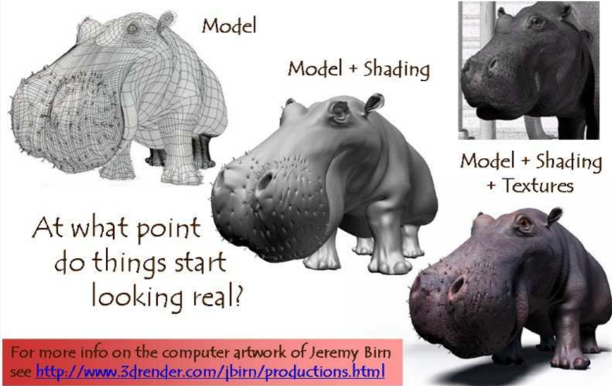
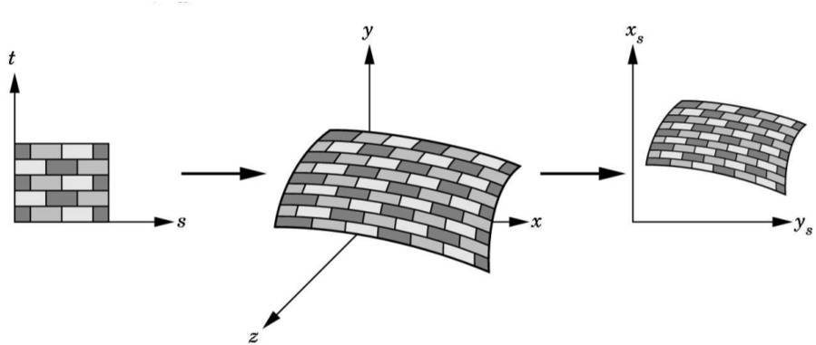
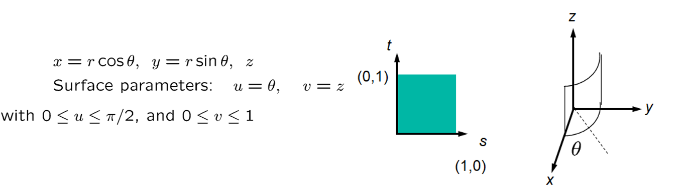
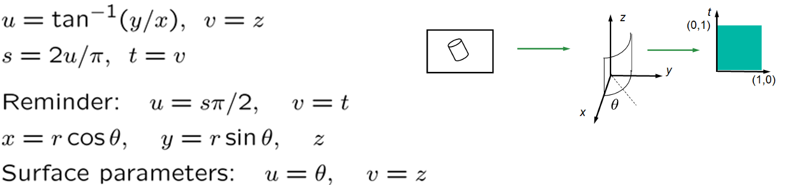
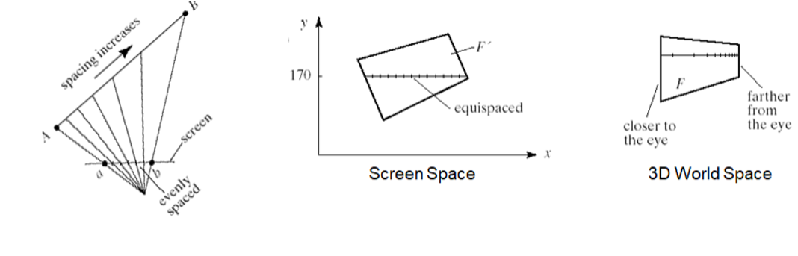
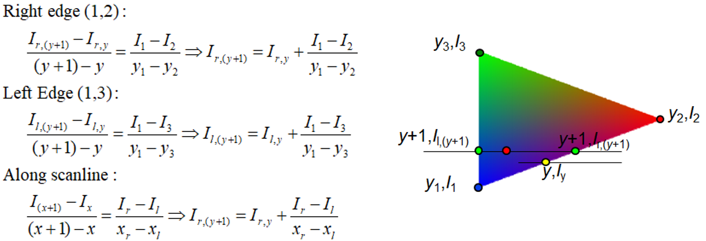

# Texture Mapping

- There are small surface details on real objects that need to be taken into account for better realism. 
  
  

- To take these into account apply texture to our images to make the surfaces realistic 

  - We can scan textures from real world or paint them

  - Store the texture as a 2D image

  - We map the texture to **object space** and then **screen space**

    

- A practical approach is to do the screen to texture transformation (so that we don’t have to deal with pixel coverage issues)

- Some texture to object transformations

  - Square to cylinder

    

  - From screen to texture:

    - Inverse the transform $(s_x,s_y)$ to get the world $(x,y,z)$
    - With $(x,y,z)$: 

    

- Intuitively speaking, only vertices are sent down to the graphics pipeline so we need to interpolate the texture coordinates

- This is done by a scanline in screen space 

- It is had its own issues such as **perspective foreshortening (why ?)**

  

- How do we correctly figure out the texture coordinates ? 

  - Interpolate along the scanline 

    

  - Perform perspective division **after** interpolation

## Quiz

1. Which of the following is correct ? 

   a. Textures are applied in the vertex processing stage of the graphics pipeline

   b. Texture coordinates are typically assigned at vertices and interpolated to the interior of a triangle

   c. Bump mapping can correct the distortion problems that occurred when applying a wood image map to a 3D object

   d. Only b and c 

   e. a , b and c

2. Texture coordinates are typically assigned at vertices and interpolated to the interior of a triangle.

   a. True

   b. False

